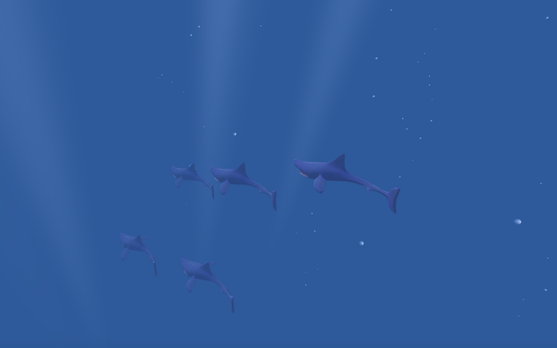

# School of Fish Simulator

School of fish simulator made with Unity

## Demo

[https://fura2.github.io/Fish/](https://fura2.github.io/fish/)

## Usage

- ``W`` or ``Up`` key : go up
- ``S`` or ``Down`` key : go down
- ``A`` or ``Left`` key : go left
- ``D`` or ``Right`` key : go right
- ``Q`` key : go backward
- ``E`` key : go forward

## How to open the Unity project

Unity version: 2020.3.2f1

In preparation
